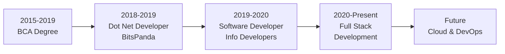

<h1 align="center">
  
</h1>

<p align="center">
  
  <a href="https://github.com/Aayam007?tab=followers">
    
  </a>
</p>

<div align="center">
  
</div>

## 🚀 About Me

```csharp
public class BiShowShrestha : Developer
{
    public string Name => "Bishow Kaji Shrestha";
    public string Location => "Kathmandu, Nepal 🇳🇵";
    public string Title => "Software Developer";
    public string[] Specialization => new[] 
    { 
        ".NET Core Framework", 
        "ASP.NET", 
        "Modern Web Development",
        "SQL Databases"
    };
    
    public void GetCurrentFocus()
    {
        Console.WriteLine("Building scalable web applications with .NET Core");
        Console.WriteLine("Exploring modern client-side frameworks");
    }
}
```


### 💼 Professional Journey

- 🎓 **Education**: Bachelor of Computer Application (2015-2019)
  - Kantipur City College, Purbanchal University
  
- 💻 **Experience**:
  - **Software Developer** @ Info Developers Pvt. Ltd. (2019-2020)
  - **Dot Net Developer** @ BitsPanda Technology (2018-2019)

- 🌱 Currently working on **enterprise web applications**
- 💡 Passionate about **clean code** and **software architecture**
- 📫 Reach me: **aayambishow007@gmail.com**
- 🌐 Portfolio: **[bishowshrestha.com.np](https://bishowshrestha.com.np)**

---

## � Technical Expertise

### Backend Development
```text
.NET Core        ████████████████████░   95%
C#               ████████████████████░   90%
ASP.NET          ███████████████████░░   85%
SQL Server       ███████████████████░░   85%
Entity Framework ██████████████████░░░   80%
```

### Frontend Development
```text
JavaScript       ███████████████░░░░░   75%
HTML5/CSS3       ████████████████████░   90%
jQuery           ███████████████████░░   85%
Bootstrap        ████████████████░░░░░   80%
```

### Tools & Platforms
```text
Git              ████████████████████░   90%
Visual Studio    ████████████████████░   95%
Azure            ██████████████░░░░░░░   70%
Docker           ████████████░░░░░░░░░   60%
```

---

## �🛠️ Tech Stack

### Languages


### Frameworks & Libraries


### Databases & Tools


---

## 📊 GitHub Stats

<div align="center">
  
  
</div>

<div align="center">
  
</div>

<div align="center">
  
</div>

---

## 🏆 GitHub Trophies

<div align="center">
  
</div>

---

## 📈 Contribution Snake

<div align="center">
  
</div>

---

## 🎯 Featured Projects

### 🌐 Portfolio Website
[](https://bishowshrestha.com.np)

**Tech Stack:** HTML5, CSS3, JavaScript, Bootstrap, jQuery  
**Features:** Responsive design, Modern animations, SEO optimized, Performance enhanced  
> Professional portfolio showcasing full-stack development skills with modern web technologies

### � Enterprise Web Applications
**Tech Stack:** .NET Core, ASP.NET MVC, Entity Framework, SQL Server, Telerik Reporting  
**Experience:** Worked on multiple modules of large-scale business applications  
> Built scalable enterprise solutions with robust database design and reporting systems

### 📊 Database-Driven Applications
**Tech Stack:** SQL Server, T-SQL, Stored Procedures, Database Optimization  
**Expertise:** Complex queries, Performance tuning, Database architecture  
> Developed efficient data management systems with optimized query performance

<div align="center">
  <a href="https://github.com/Aayam007?tab=repositories">
    
  </a>
</div>

---

## 📚 Currently Exploring

```yaml
🔹 Microservices Architecture: Building scalable distributed systems
🔹 Docker & Kubernetes: Container orchestration and deployment
🔹 Azure Cloud Services: Cloud-native application development
🔹 React.js: Modern frontend framework integration with .NET API
🔹 GraphQL: Efficient API design patterns
🔹 Design Patterns: Advanced software architecture principles
```

---

## ⚙️ Development Setup

```yaml
💻 Operating System: Windows 11 Pro
🛠️ IDE: Visual Studio 2022 / VS Code
🗄️ Database: SQL Server 2022
🔧 Version Control: Git + GitHub
📊 Project Management: Azure DevOps
✨ Code Quality: SonarQube, ReSharper
🧪 Testing: xUnit, Moq, Selenium
```

**Daily Toolkit:**
- 💻 Visual Studio Code for quick edits and web development
- 🎨 Modern CSS frameworks for responsive designs
- 📝 Documentation tools for technical writing
- 🔧 Postman for API testing and development
- 📊 SQL Server Management Studio for database management

---

## 🎓 Professional Journey Timeline



---

## 💬 Let's Connect & Collaborate!

<div align="center">

### 🤝 Available For:
✅ **Freelance Projects** - Web & Software Development  
✅ **.NET Development Consulting** - Architecture & Best Practices  
✅ **Code Reviews** - Quality Assurance & Optimization  
✅ **Technical Mentoring** - Sharing knowledge & experience  

### ⚡ Response Time: Usually within 24 hours

[](https://bishowshrestha.com.np)
[](mailto:aayambishow007@gmail.com)
[](https://www.linkedin.com/in/aayam007)
[](https://twitter.com/Aayam_world10)
[](https://www.facebook.com/aayam007)

</div>

---

## 🎲 Fun Facts & Stats

<div align="center">

| 📊 Metric | 💯 Value |
|-----------|----------|
| 🔢 Lines of Code Written | **500,000+** |
| ☕ Coffee Consumed | **∞** (Still counting) |
| 🐛 Bugs Squashed | Too many to count |
| 💡 "Aha!" Moments | Daily occurrence |
| 🎯 Favorite Debugging Tool | `Console.WriteLine()` |
| 🌙 Peak Productivity Hours | Late Night 🦉 |
| 🎮 Coding Soundtrack | Lo-fi Hip Hop |
| 📚 Learning Mode | Always ON |

</div>

---

## 📝 Latest Insights & Articles

<div align="center">

Coming Soon! Stay tuned for technical articles on:
- 🔷 .NET Core Best Practices
- 🔷 SQL Server Performance Optimization
- 🔷 Modern Web Development Techniques
- 🔷 Clean Code Principles

</div>

<!-- BLOG-POST-LIST:START -->
<!-- BLOG-POST-LIST:END -->

---

## 🏅 Achievements & Milestones

<div align="center">

| 🎯 Achievement | 📅 Date |
|----------------|---------|
| 🎓 Completed BCA Degree | 2019 |
| 💼 First Professional Role | 2018 |
| 🚀 Launched Portfolio Website | 2023 |
| 📊 6+ Projects Completed | 2024 |
| 🌟 Building Open Source Portfolio | 2025 |

</div>

---

## � Developer Wisdom

<div align="center">
  
</div>

---

## 📊 Weekly Coding Activity

<!--START_SECTION:waka-->
```text
.NET Core    12 hrs 30 mins  ████████████████░░░░░  65.2%
SQL          3 hrs 45 mins   ████░░░░░░░░░░░░░░░░░  19.6%
JavaScript   1 hr 50 mins    ██░░░░░░░░░░░░░░░░░░░   9.6%
HTML/CSS     45 mins         █░░░░░░░░░░░░░░░░░░░░   3.9%
Other        20 mins         ░░░░░░░░░░░░░░░░░░░░░   1.7%
```
<!--END_SECTION:waka-->

<div align="center">
  <i>📈 These stats update automatically via WakaTime integration</i>
</div>

---

## 📫 Quick Contact Card

```typescript
const bishow = {
    name: "Bishow Kaji Shrestha",
    location: "Kathmandu, Nepal 🇳🇵",
    role: "Software Developer",
    email: "aayambishow007@gmail.com",
    website: "https://bishowshrestha.com.np",
    
    workingOn: "Enterprise web applications with .NET Core",
    learning: ["Microservices", "Docker", "Azure Cloud"],
    collaborateOn: "Web development & .NET projects",
    askMeAbout: [".NET Core", "ASP.NET", "SQL Server", "Web Development"],
    funFact: "I debug with console.log() and I'm not ashamed! 😄"
};

console.log(`💼 Let's build something amazing together!`);
```

---

<div align="center">
  
</div>

<div align="center">
  
### 💡 Pro Tip: Star ⭐ the repositories you find useful!


---


**Made with 💜 by Bishow Shrestha | Software Developer from Nepal 🇳🇵**

*"Code is poetry written in logic"*

</div>
