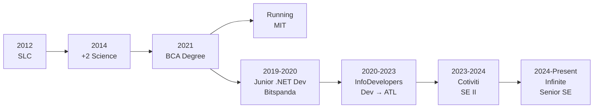

<h1 align="center">
  
</h1>

<p align="center">
  
  <a href="https://github.com/Aayam007?tab=followers">
    
  </a>
</p>

<div align="center">
  
</div>

## 🚀 About Me

```csharp
public class BiShowShrestha : Developer
{
    public string Name => "Bishow Kaji Shrestha";
    public string Location => "Kathmandu, Nepal 🇳🇵";
    public string Title => "Software Engineer";
    public string[] Specialization => new[] 
    { 
        ".NET / ASP.NET Core",
        "Angular (TypeScript)",
        "Microservices Architecture",
        "SQL Server / Oracle / PostgreSQL"
    };
    
    public void GetCurrentFocus()
    {
        Console.WriteLine("Building scalable enterprise systems with .NET Core");
        Console.WriteLine("Delivering secure, compliant solutions (HIPAA)");
    }
}
```


### 💼 Professional Journey

- 🎓 **Education**:
  - MIT (Running) — Tribhuvan University
  - Bachelor Of Computer Application (2021) — Kantipur City College, Purbanchal University
  
- 💻 **Experience** (6+ years):
  - **Senior Software Engineer** @ Infinite Computer Solutions (Feb 2024 – Present)
  - **Software Engineer II** @ Cotiviti Nepal (Jan 2023 – Feb 2024)
  - **Associate Team Lead / Sr. Software Engineer / Software Developer** @ InfoDevelopers Pvt. Ltd. (Mar 2020 – Jan 2023)
  - **Junior .NET Developer** @ Bitspanda Technology (Dec 2019 – Feb 2020)

- 🌱 Currently building **U.S.-based insurance/healthcare management systems** with .NET + Angular
- 💡 Focused on **clean code**, **architecture**, and **team leadership in Agile/Scrum**
- 📫 Reach me: **aayambishow007@gmail.com** | **9843573229**
- 🌐 Portfolio: **[bishowshrestha.com.np](https://bishowshrestha.com.np)**

---

## 💻 Technical Expertise

### Backend Development
```text
.NET / ASP.NET Core  ████████████████████░   95%
C#                   ████████████████████░   92%
SQL Server            ███████████████████░░   88%
Microservices          ██████████████████░░░   82%
IdentityServer/OAuth2  █████████████████░░░░   78%
```

### Frontend Development
```text
Angular/TypeScript █████████████████░░░░   80%
JavaScript         █████████████████░░░░   80%
HTML5/CSS3         ████████████████████░   90%
jQuery             ███████████████████░░   85%
```

### Tools & Platforms
```text
Git                 ████████████████████░   92%
JIRA/Agile           ███████████████████░░   88%
CI/CD (Jenkins etc.) █████████████████░░░░   80%
SQL/Reporting Tools  █████████████████░░░░   80%
```

---

## 🛠️ Tech Stack

### Languages


### Frameworks & Libraries


### Databases & Tools


---

## 📊 GitHub Stats
<div align="center">
  
</div>

<div align="center">
  
</div>

---

## 🏆 GitHub Trophies

<div align="center">
  
</div>

---

## 📈 Contribution Snake

<div align="center">
  
</div>

---

## 🎯 Featured Projects

### 🏥 Insurance Management System (HIPAA)
**Project:** Mavis, Insight, MECA (Ongoing)  
**Tech Stack:** .NET, Angular, Oracle, SQL Server  
**Highlights:** Core feature development, OCR integration, code optimization, HIPAA-compliant delivery  
> Building and optimizing U.S.-based insurance management modules with secure, performant APIs

### 🏦 Government Core Banking System (CBS)
**Tech Stack:** .NET Core 3.1, SQL Server, Telerik Reporting, pqGrid  
**Highlights:** Team leadership, microservices architecture, reporting optimization, IdentityServer integration  
> Led delivery of a large-scale CBS for a government office (CIT), focused on reporting and secure auth

### 🌱 Agro-Related CMS
**Tech Stack:** C#, JavaScript, HTML, CSS, SQL  
**Highlights:** Third-party API integrations, database performance optimization, product maintenance  
> Developed and maintained an agro/veterinary-focused CMS with reliable integrations

<div align="center">
  <a href="https://github.com/Aayam007?tab=repositories">
    
  </a>
</div>

---

## 📚 Currently Exploring

```yaml
🔹 Microservices Architecture: Building scalable distributed systems
🔹 CI/CD: Jenkins, Bamboo, Bitbucket Pipelines, Octopus
🔹 Messaging & Cache: RabbitMQ, Redis
🔹 Search: Elasticsearch
🔹 OCR Integration: Improving document processing workflows
🔹 Design Patterns: Applied software architecture principles
```

---

## ⚙️ Development Setup

```yaml
💻 Operating System: Windows 11 Pro
🛠️ IDE: Visual Studio 2022 / VS Code
🗄️ Database: SQL Server / Oracle / PostgreSQL
🔧 Version Control: Git + GitHub
📊 Project Management: JIRA
✨ Code Quality: SonarQube, ReSharper
🧪 Testing: xUnit, Moq, Selenium
```

**Daily Toolkit:**
- 💻 Visual Studio Code for quick edits and web development
- 🎨 Modern CSS frameworks for responsive designs
- 📝 Documentation tools for technical writing
- 🔧 Postman for API testing and development
- 📊 SQL Server Management Studio for database management

---

## 🎓 Professional Journey Timeline


```mermaid
graph LR
  A[2012<br/>SLC] --> B[2014<br/>+2 Science]
  B --> C[2021<br/>BCA Degree]
  C --> H[Running<br/>MIT]
  C --> D[2019-2020<br/>Junior .NET Dev<br/>Bitspanda]
  D --> E[2020-2023<br/>InfoDevelopers<br/>Dev → ATL]
  E --> F[2023-2024<br/>Cotiviti<br/>SE II]
  F --> G[2024-Present<br/>Infinite<br/>Senior SE]
```

---

## 💬 Let's Connect & Collaborate!

<div align="center">

### 🤝 Available For:
✅ **Freelance Projects** - Web & Software Development  
✅ **.NET Development Consulting** - Architecture & Best Practices  
✅ **Code Reviews** - Quality Assurance & Optimization  
✅ **Technical Mentoring** - Sharing knowledge & experience  

### ⚡ Response Time: Usually within 24 hours

[](https://bishowshrestha.com.np)
[](mailto:aayambishow007@gmail.com)
[](https://www.linkedin.com/in/aayam007)
[](https://twitter.com/Aayam_world10)
[](https://www.facebook.com/aayam007)

</div>

---

## 🎲 Fun Facts & Stats

<div align="center">

| 📊 Metric | 💯 Value |
|-----------|----------|
| 🔢 Lines of Code Written | **500,000+** |
| ☕ Coffee Consumed | **∞** (Still counting) |
| 🐛 Bugs Squashed | Too many to count |
| 💡 "Aha!" Moments | Daily occurrence |
| 🎯 Favorite Debugging Tool | `Console.WriteLine()` |
| 🌙 Peak Productivity Hours | Late Night 🦉 |
| 🎮 Coding Soundtrack | Lo-fi Hip Hop |
| 📚 Learning Mode | Always ON |

</div>

---

## 📝 Latest Insights & Articles

<div align="center">

Coming Soon! Stay tuned for technical articles on:
- 🔷 .NET Core Best Practices
- 🔷 SQL Server Performance Optimization
- 🔷 Modern Web Development Techniques
- 🔷 Clean Code Principles

</div>

<!-- BLOG-POST-LIST:START -->
<!-- BLOG-POST-LIST:END -->

---

## 🏅 Achievements & Milestones

<div align="center">

| 🎯 Achievement | 📅 Date |
|----------------|---------|
| 🎓 Completed BCA Degree | 2021 |
| 🧩 Registered Scrum Master | 2021 |
| 🎓 Exemplary Leadership Training | 2022 |
| 🧩 Certified SAFe® Practitioner | 2024 |
| 🏅 Spot Award (Performer of month) | May 2025 |
| 🏅 Spark Award (Top Performer of Quarter) | Q2 2025 |
| 🏅 Spark Award (Performer of the Quarter) | Jan–Mar 2026 |

</div>

---

## 💡 Developer Wisdom

<div align="center">
  
</div>

---

## 📊 Weekly Coding Activity

<!--START_SECTION:waka-->
```text
.NET Core    12 hrs 30 mins  ████████████████░░░░░  65.2%
SQL          3 hrs 45 mins   ████░░░░░░░░░░░░░░░░░  19.6%
JavaScript   1 hr 50 mins    ██░░░░░░░░░░░░░░░░░░░   9.6%
HTML/CSS     45 mins         █░░░░░░░░░░░░░░░░░░░░   3.9%
Other        20 mins         ░░░░░░░░░░░░░░░░░░░░░   1.7%
```
<!--END_SECTION:waka-->

<div align="center">
  <i>📈 These stats update automatically via WakaTime integration</i>
</div>

---

## 📫 Quick Contact Card

```typescript
const bishow = {
    name: "Bishow Kaji Shrestha",
    location: "Kathmandu, Nepal 🇳🇵",
    role: "Senior Software Engineer",
    email: "aayambishow007@gmail.com",
    phone: "9843573229",
    website: "https://bishowshrestha.com.np",
    
    workingOn: "Enterprise systems with .NET + Angular (HIPAA-aware)",
    learning: ["Microservices", "Docker", "Azure Cloud"],
    collaborateOn: "Web development & .NET projects",
    askMeAbout: [".NET / ASP.NET Core", "Angular", "SQL Server", "Microservices", "CI/CD"],
    funFact: "I debug with console.log() and I'm not ashamed! 😄"
};

console.log(`💼 Let's build something amazing together!`);
```


**Made with 💜 by Bishow Shrestha | Software Engineer from Nepal 🇳🇵**

*"Code is poetry written in logic"*

</div>
